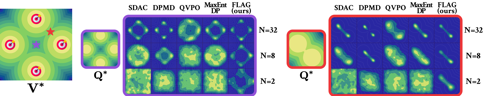
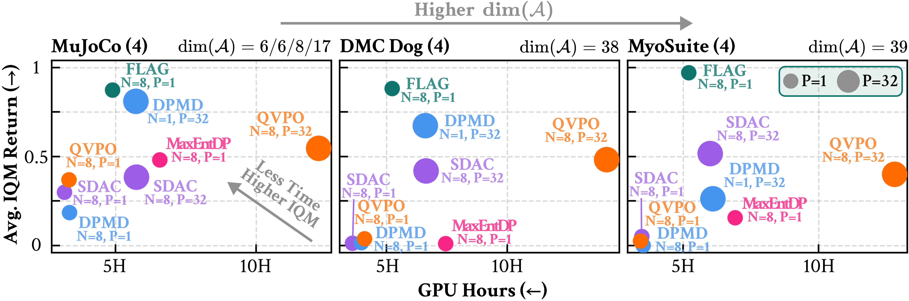

# FLAG: Flow Policy MaxEnt-RL by Latent Augmented Guidance

FLAG is a Maximum Entropy Reinforcement Learning framework that trains expressive flow-based policies via supervised latent-augmented guidance — without backpropagation through time (BPTT) or importance weight collapse. Standard EM-based policy optimization relies on global importance sampling (IS) over the full action space, which suffers from weight degeneracy in high dimensions. FLAG avoids this by augmenting the MDP with a flow latent variable, inducing a local IS between distributions that share the same support, yielding dense and informative supervision at every update step. As shown below, FLAG captures all target modes even at N = 2, and consistently achieves higher IQM returns with less compute across MuJoCo, DMC Dog, and MyoSuite benchmarks — outperforming both global IS baselines and BPTT-based actor-critic methods without additional computational overhead.

<p align="center">
  <br>
  <em>Policy distributions learned by each method in the multi-goal environment under varying sample budgets N. While global IS baselines fail at N ≤ 8, FLAG recovers all target modes even at N = 2.</em>
</p>

<p align="center">
  <br>
  <em>IQM return vs. wall-clock GPU hours across three benchmarks with increasing action dimensionality. Methods in the upper-left are preferable (less time, higher IQM). FLAG (N=8, P=1) consistently occupies this region without additional computational overhead.</em>
</p>

## Environment setup

MyoSuite and Gymnasium v5 are not compatible in the same environment. Use two separate conda environments.

### `flag-dmc` (DMControl / Gymnasium v5)

```bash
conda create -n flag-dmc python=3.10 -y
conda activate flag-dmc
pip install -r requirements_dmc.txt
```

### `flag-myo` (MyoSuite)

```bash
conda create -n flag-myo python=3.10 -y
conda activate flag-myo
pip install -r requirements_myo.txt
```

### Stack

- **JAX + CUDA 12** (`jax`, `jax-cuda12-plugin`) — array library and JIT compiler. All forward/backward passes are compiled with `jax.jit` (via `@nnx.jit`). Random state is explicit: every sampling call takes a PRNG key derived from a `flax.nnx.Rngs` stream.
- **Flax NNX** (`flax.nnx`) — neural network library. Models are plain Python classes that subclass `nnx.Module`. Parameters are stored as `nnx.Param` attributes and updated in-place through `nnx.Optimizer`. This is the newer NNX API (Flax ≥ 0.8), not the older Linen (`flax.linen`) API.

## Run a single experiment

**DMC/Gym-v5**
```bash
MUJOCO_GL=egl LD_LIBRARY_PATH= CUDA_VISIBLE_DEVICES=0 python train.py env_id=dm_control/dog-trot seed=42
```

**MyoSuite**
```bash
MUJOCO_GL=egl LD_LIBRARY_PATH= CUDA_VISIBLE_DEVICES=0 python train.py env_id=myo-reach-hard seed=42
```

Hyperparameters are set via Hydra overrides. See `conf/config.yaml` for all available options.

## Supported environments

Wrappers live in `src/flag/utils/wrappers/`.

### DMControl (`src/flag/utils/wrappers/dmcontrol.py`)

Use `flag-dmc`. Env IDs follow the pattern `dm_control/<domain>-<task>-v0` (`dm_control/dog-trot-v0`, ...).

### Gymnasium MuJoCo (`src/flag/utils/wrappers/mujoco.py`)

Use `flag-dmc`. Standard Gymnasium v5 env IDs (`HalfCheetah-v5`, ...).

### MyoSuite (`src/flag/utils/wrappers/myosuite.py`)

Use `flag-myo` (`myo-reach-hard`, `myo-obj-hold-hard`, ...).

## Troubleshooting

**Device falls back to CPU**
Clear `LD_LIBRARY_PATH` before running:
```bash
export LD_LIBRARY_PATH=
```

**MuJoCo rendering errors (`egl`, `GLFWError`, `osmesa`)**
`train.py` sets `MUJOCO_GL=egl` unconditionally, which is correct for headless Linux servers but will fail on macOS or machines without EGL. Override it before running:
```bash
# macOS
MUJOCO_GL=glfw CUDA_VISIBLE_DEVICES=0 python train.py env_id=HalfCheetah-v5 seed=42

# Headless Linux without EGL (e.g. CPU-only node)
MUJOCO_GL=osmesa CUDA_VISIBLE_DEVICES=0 python train.py env_id=HalfCheetah-v5 seed=42
```
